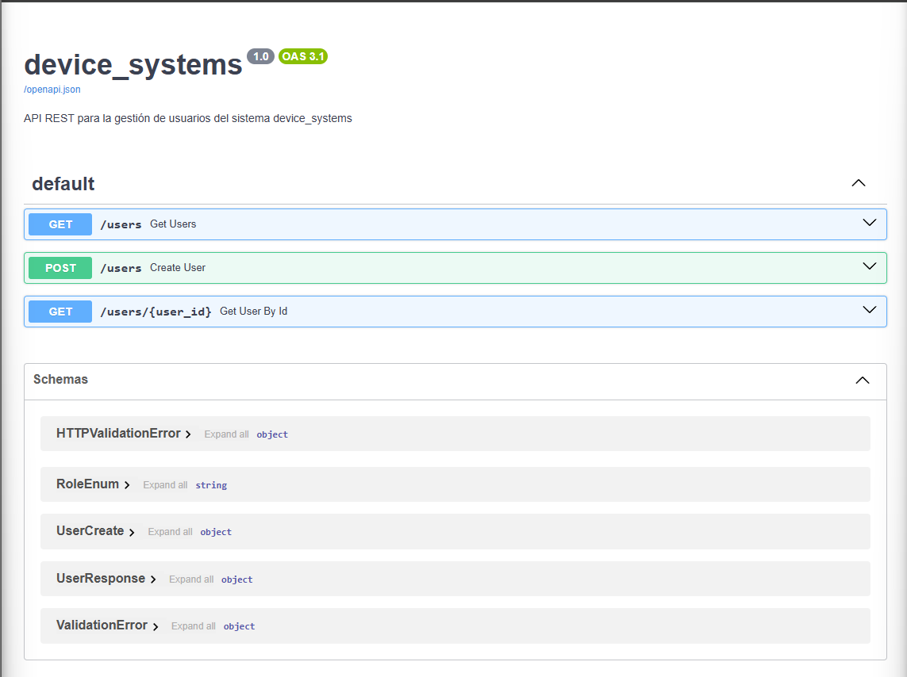

# device_systems

API REST construida con **FastAPI** para la gestión de usuarios del sistema `device_systems`.

---

## Instalación de dependencias

```bash
pip install fastapi uvicorn "pydantic[email]"
```

---

## Ejecución del servidor

Desde la carpeta raíz del proyecto (`device_systems/`):

```bash
uvicorn app.main:app --reload
```

El servidor queda disponible en: `http://127.0.0.1:8000`  
Documentación Swagger UI: `http://127.0.0.1:8000/docs`

---

## Tabla de endpoints

| Método | Endpoint              | Descripción                          | Status |
|--------|-----------------------|--------------------------------------|--------|
| GET    | /users                | Listar todos los usuarios            | 200    |
| GET    | /users/{user_id}      | Obtener usuario por ID               | 200    |
| GET    | /users?role=admin     | Filtrar usuarios por rol             | 200    |
| GET    | /users?is_active=true | Filtrar usuarios por estado activo   | 200    |
| POST   | /users                | Crear un nuevo usuario               | 201    |

---

## Ejemplos de peticiones

### GET /users
```
GET http://127.0.0.1:8000/users
```

### GET /users/{user_id}
```
GET http://127.0.0.1:8000/users/1
```

### GET /users?role=admin
```
GET http://127.0.0.1:8000/users?role=admin
```

### GET /users?is_active=true
```
GET http://127.0.0.1:8000/users?is_active=true
```

### POST /users
```
POST http://127.0.0.1:8000/users
Content-Type: application/json

{
  "name": "Juan Pérez",
  "email": "juan@gmail.com",
  "role": "user",
  "is_active": true
}
```

---

## Capturas de Swagger UI y pruebas

### Swagger UI


### GET - Todos los usuarios


### GET - Usuario por ID


### GET - Filtro por role


### GET - Filtro por is_active


### POST - Crear usuario


### POST - Email duplicado (Error 400)


### POST - Error de validación (Error 422)


---

## Cabeceras personalizadas en respuestas

Todas las respuestas incluyen:

| Cabecera        | Valor           |
|-----------------|-----------------|
| X-App-Name      | device_systems  |
| X-API-Version   | 1.0             |

---

## Reflexión

FastAPI permite construir APIs REST de forma rápida y ordenada. La integración con Pydantic facilita la validación automática de datos, reduciendo errores y haciendo el código más legible. Los modelos de respuesta garantizan que solo se exponga la información necesaria al cliente.