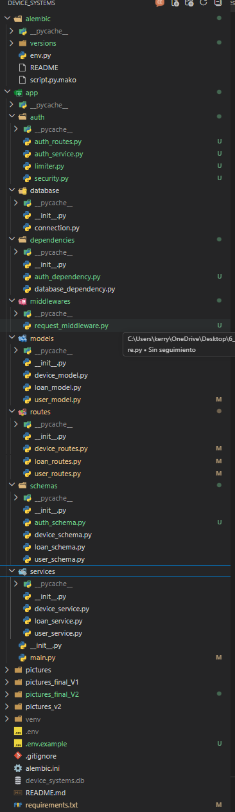
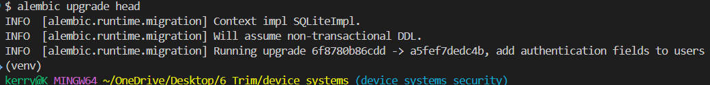
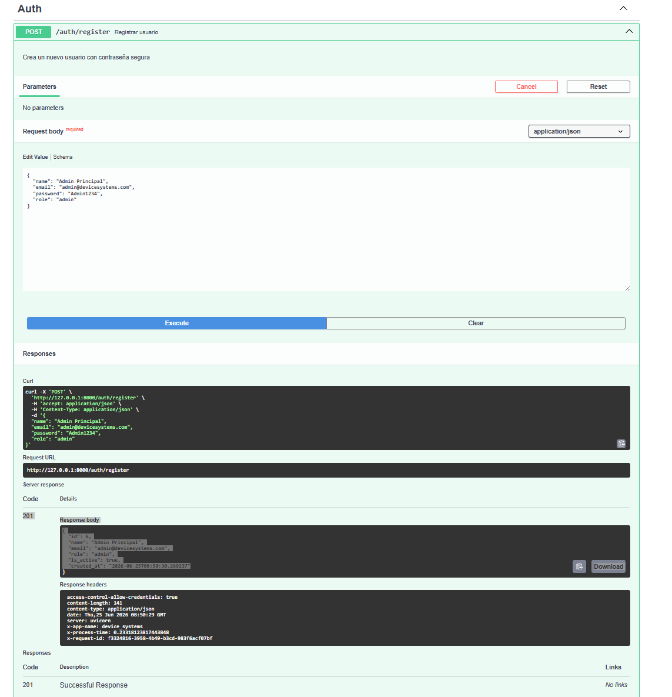
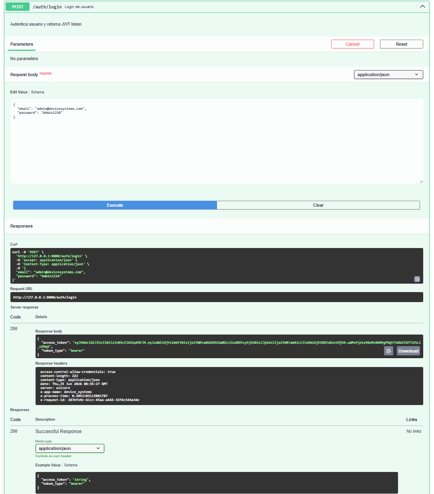
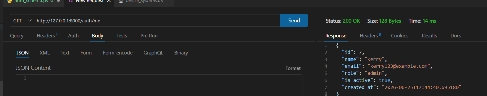
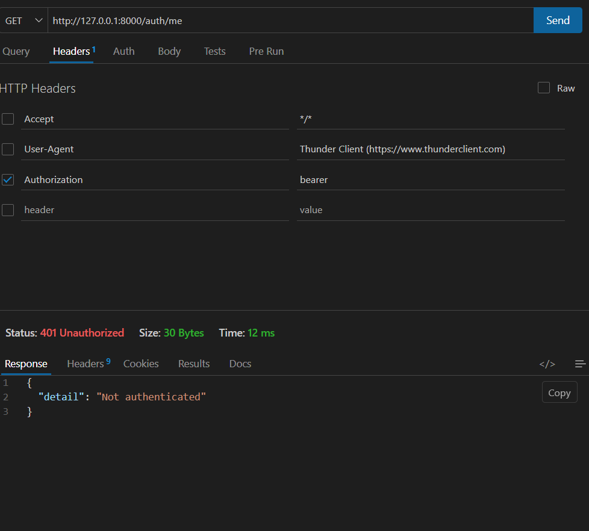
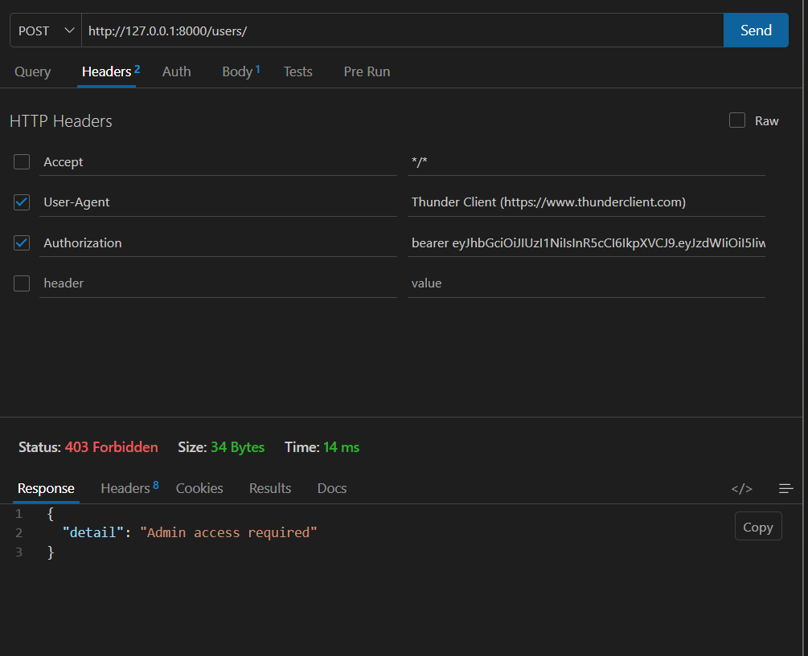
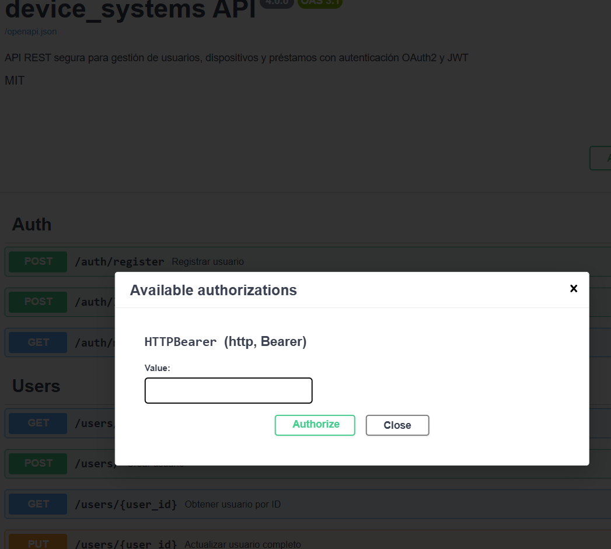
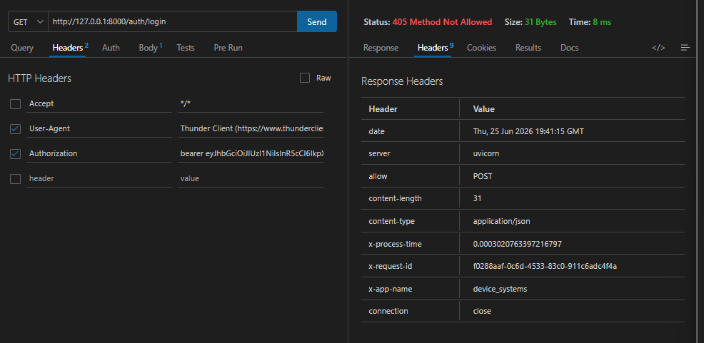
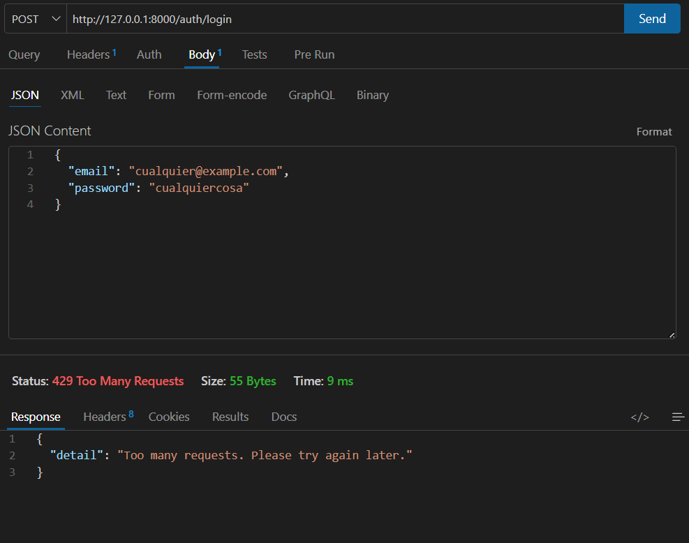

# Device Systems API

API REST segura para gestión de usuarios, dispositivos y préstamos, construida con **FastAPI**, **SQLAlchemy** y **Alembic**, con autenticación basada en **JWT (Bearer)**, control de roles, rate limiting y middleware personalizado.

---

## 📁 Estructura del proyecto

El proyecto está organizado en capas: rutas, servicios, modelos, schemas, dependencias y middlewares, siguiendo una separación clara de responsabilidades típica de una API FastAPI escalable.



---

## 🗄️ Migraciones con Alembic

Las migraciones de base de datos se gestionan con Alembic. Se crearon migraciones incrementales para las tablas `Device` y `Loan`, incluyendo sus relaciones con `User`, sobre la rama `device_systems_alembic_relaciones`.



---

## 🔐 Autenticación y autorización

### Registro de usuario

Se valida que el email sea único y que la contraseña cumpla reglas de seguridad (mínimo 8 caracteres, al menos una mayúscula, una minúscula, un número, y sin espacios).



### Login y generación de token

Al autenticarse correctamente, el sistema genera un JWT firmado que incluye el `id`, `email` y `role` del usuario como claims, evitando consultas repetidas a la base de datos en cada request protegido.



### Obtener usuario autenticado (`/auth/me`)

Con un token válido, el endpoint `/auth/me` decodifica el JWT y retorna los datos del usuario autenticado.



### Acceso sin token

Cualquier endpoint protegido rechaza las peticiones que no incluyan un token Bearer válido, devolviendo `401 Unauthorized`.



### Acceso con rol no permitido

Los endpoints administrativos (como la creación de usuarios) están protegidos con una dependencia `require_admin`. Un usuario autenticado pero sin el rol adecuado recibe `403 Forbidden`.



---

## 📑 Documentación interactiva (Swagger / OpenAPI)

FastAPI expone automáticamente la documentación OpenAPI en `/docs`, incluyendo el esquema de seguridad **HTTPBearer**, que permite autorizar las peticiones directamente desde la interfaz con el botón "Authorize".



---

## 🧩 Middleware personalizado

Cada respuesta de la API incluye cabeceras personalizadas inyectadas por un middleware propio (`RequestMiddleware`), útiles para trazabilidad y monitoreo:

- `x-app-name`: nombre de la aplicación.
- `x-process-time`: tiempo de procesamiento de la petición.
- `x-request-id`: identificador único de la petición, útil para rastrear errores en los logs del servidor.



---

## 🚦 Rate limiting

Se implementó limitación de peticiones con `slowapi` para proteger los endpoints de autenticación contra abuso (por ejemplo, ataques de fuerza bruta sobre el login):

- `POST /auth/register`: máximo 3 peticiones por minuto.
- `POST /auth/login`: máximo 5 peticiones por minuto.

Al superar el límite, la API responde con `429 Too Many Requests`.



---

## 🌐 CORS configurado

El proyecto utiliza `CORSMiddleware` de FastAPI para controlar qué orígenes externos pueden consumir la API desde un navegador:

```python
cors_origins = os.getenv("CORS_ORIGINS", "http://localhost:5173,http://localhost:3000,http://localhost:8000").split(",")

app.add_middleware(
    CORSMiddleware,
    allow_origins=cors_origins,
    allow_credentials=True,
    allow_methods=["*"],
    allow_headers=["*"],
)
```

**Explicación de la configuración:**

- **`allow_origins`**: la lista de orígenes permitidos se obtiene de la variable de entorno `CORS_ORIGINS`, con un valor por defecto orientado a desarrollo local (`localhost:5173` para Vite, `localhost:3000` para React/Next, y `localhost:8000` para pruebas directas contra el propio backend). Esto permite cambiar los orígenes permitidos sin modificar el código al pasar a otro entorno (por ejemplo, producción).
- **`allow_credentials=True`**: permite que el navegador envíe credenciales (cookies, headers de autorización como el JWT) en las peticiones cross-origin. Es necesario porque el flujo de autenticación de esta API depende del header `Authorization: Bearer <token>`.
- **`allow_methods=["*"]`**: permite todos los métodos HTTP (`GET`, `POST`, `PUT`, `PATCH`, `DELETE`), ya que la API expone operaciones CRUD completas sobre usuarios, dispositivos y préstamos.
- **`allow_headers=["*"]`**: permite cualquier header en las peticiones entrantes, dando flexibilidad al frontend para enviar headers personalizados además del `Authorization`.

Esta configuración es adecuada para desarrollo, donde se necesita flexibilidad entre distintos puertos locales. En un entorno de producción real, lo recomendable sería restringir `allow_origins` únicamente al dominio real del frontend, y acotar `allow_methods` y `allow_headers` a los estrictamente necesarios, reduciendo la superficie de ataque.

---

## 🪞 Reflexión final sobre la importancia de la seguridad en APIs REST

Construir esta API dejó en evidencia que la seguridad de un backend no se reduce a "agregar un login" — es un conjunto de capas que deben trabajar de forma coherente entre sí. Un solo detalle mal definido, como declarar el campo `sub` de un JWT como `int` en lugar de `str`, fue suficiente para romper por completo el flujo de autenticación, a pesar de que cada pieza individual (login, firma del token, decodificación) parecía estar bien implementada por separado. Esto demuestra que la seguridad de una API depende tanto del cumplimiento de estándares externos (como el RFC 7519 para JWT) como del comportamiento interno de las herramientas que se usan (como la coerción de tipos de Pydantic), y que ambos deben entenderse en conjunto, no de forma aislada.

Más allá del bug puntual, el proyecto reforzó varios principios fundamentales:

- **La autenticación no es lo mismo que la autorización.** Verificar que un usuario es quien dice ser (JWT válido) es solo el primer paso; decidir qué puede hacer ese usuario (control de roles con `admin`, `support`, `user`) es una capa adicional e igualmente necesaria. Un endpoint protegido solo por autenticación, sin verificación de rol, expondría operaciones sensibles a cualquier usuario autenticado, sin importar su nivel de privilegio.
- **Los errores de seguridad no deben revelar información interna.** Atrapar la excepción técnica de `python-jose` y traducirla a un mensaje genérico ("Invalid or expired token") evita filtrar detalles internos de implementación a un posible atacante, aunque a costa de dificultar el debugging — por eso la importancia de tener logs detallados en el servidor, separados de lo que ve el cliente final.
- **Limitar la tasa de peticiones (rate limiting) es una defensa básica pero crítica**, especialmente en endpoints de autenticación, donde un atacante podría intentar adivinar credenciales por fuerza bruta si no existiera ningún límite.
- **CORS no es solo una configuración molesta que "hay que desactivar para que funcione"**, sino un mecanismo de seguridad del propio navegador que decide qué orígenes externos pueden interactuar con la API; configurarlo de forma demasiado permisiva (por ejemplo, con `allow_origins=["*"]` junto con `allow_credentials=True`) puede abrir la puerta a ataques de robo de sesión desde sitios maliciosos.
- **La trazabilidad importa.** Tener un middleware que asigna un `x-request-id` único a cada petición permite correlacionar errores reportados por un usuario con los logs exactos del servidor, lo cual es indispensable para diagnosticar problemas de seguridad o de cualquier otro tipo en producción.

En conjunto, este proyecto mostró que la seguridad en una API REST no es un checkbox que se marca una sola vez, sino una serie de decisiones de diseño que deben revisarse constantemente, probarse activamente (incluyendo los casos negativos: sin token, con rol incorrecto, con rate limiting excedido) y documentarse para que cualquier persona que continúe el proyecto entienda no solo qué se implementó, sino por qué.
