# Device Systems API v3.0

## 📋 Descripción

API REST profesional para gestión de usuarios, dispositivos y préstamos utilizando **FastAPI**, **SQLAlchemy**, y **Alembic**. Este proyecto implementa arquitectura MVC, migraciones de base de datos y consultas avanzadas con JOINs.

---

## 🔄 Cambios Respecto a Versión Anterior

La versión anterior solo incluía gestión de usuarios. En v3.0 hemos implementado:

- ✅ **Modelo Device** - Gestión completa de dispositivos (laptops, tablets, proyectores, etc.)
- ✅ **Modelo Loan** - Sistema de préstamos con seguimiento de devoluciones
- ✅ **Alembic Configurado** - Versionamiento profesional de migraciones de BD
- ✅ **Relaciones One-to-Many** - User ↔ Loan y Device ↔ Loan
- ✅ **CRUD Completo** - Operaciones Create, Read, Update, Delete en todas las entidades
- ✅ **Consultas con JOINs** - Optimización de queries y evitar problema N+1
- ✅ **Filtros Avanzados** - Búsquedas complejas y ordenamiento
- ✅ **Manejo Robusto de Errores** - Status codes apropiados y mensajes claros

---

## 🔧 Configuración de Alembic

### Inicializar Alembic

Se ejecutó el comando para crear la estructura de migraciones:

```bash
alembic init alembic
```

**Captura de ejecución:**

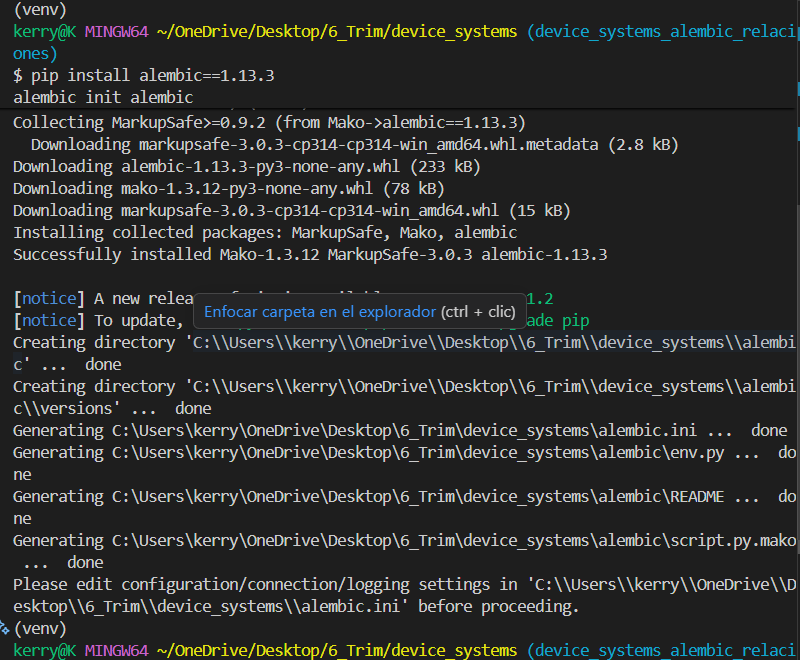

### Configuración de env.py

El archivo `alembic/env.py` se configuró para usar SQLAlchemy automáticamente:

```python
from app.database.connection import Base
from app.models.user_model import User
from app.models.device_model import Device
from app.models.loan_model import Loan

target_metadata = Base.metadata
```

Esto permite que Alembic detecte automáticamente los cambios en los modelos.

---

## 📊 Migraciones Generadas

### Primera Migración - Modelos y Relaciones

Se ejecutó el comando de autogeneración:

```bash
alembic revision --autogenerate -m "Initial migration with User Device Loan models and relationships"
```

**Captura de creación de migración:**

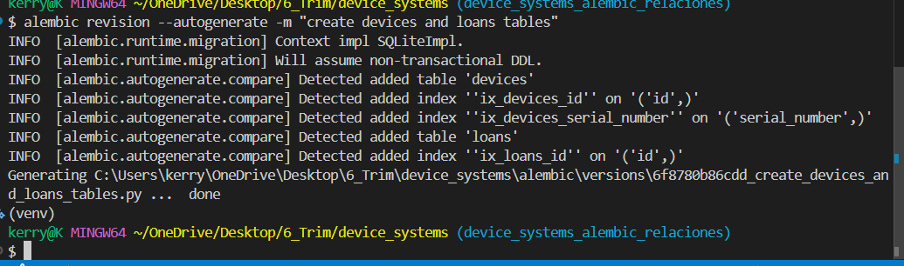

Se generó automáticamente el archivo `alembic/versions/6f8780b86cdd_create_devices_and_loans_tables.py` con:

- ✅ Tabla `devices` con todos los campos y constraints
- ✅ Tabla `loans` con Foreign Keys a users e devices
- ✅ Índices (unique en serial_number)
- ✅ Funciones upgrade() y downgrade() para migración y rollback

### Aplicación de Migraciones

Se aplicaron los cambios a la base de datos:

```bash
alembic upgrade head
```

**Captura de aplicación:**

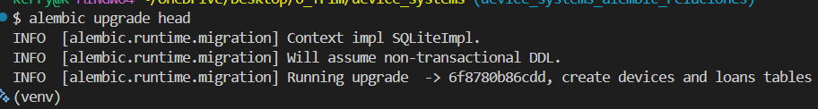

La migración se aplicó correctamente y las tablas fueron creadas en SQLite.

---

## 🗂️ Estructura de Tablas Generadas

**Captura de estructura completa:**

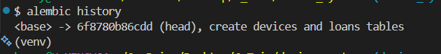

### Tabla: users

```sql
CREATE TABLE users (
    id INTEGER PRIMARY KEY,
    name VARCHAR(100) NOT NULL,
    email VARCHAR(255) UNIQUE NOT NULL,
    role VARCHAR(50) NOT NULL,           -- admin, support, user
    is_active BOOLEAN DEFAULT TRUE,
    created_at DATETIME DEFAULT CURRENT_TIMESTAMP
);
```

**Constraints:**
- `id`: Primary Key (auto-increment)
- `email`: UNIQUE (no duplicados)
- `is_active`: DEFAULT TRUE

---

### Tabla: devices

```sql
CREATE TABLE devices (
    id INTEGER PRIMARY KEY,
    name VARCHAR(100) NOT NULL,
    serial_number VARCHAR(100) UNIQUE NOT NULL,
    device_type VARCHAR(50) NOT NULL,   -- laptop, tablet, proyector
    brand VARCHAR(100),
    is_available BOOLEAN DEFAULT TRUE,
    created_at DATETIME DEFAULT CURRENT_TIMESTAMP
);
```

**Constraints:**
- `id`: Primary Key (auto-increment)
- `serial_number`: UNIQUE (identificación del dispositivo)
- `is_available`: DEFAULT TRUE

---

### Tabla: loans

```sql
CREATE TABLE loans (
    id INTEGER PRIMARY KEY,
    user_id INTEGER NOT NULL FOREIGN KEY REFERENCES users(id),
    device_id INTEGER NOT NULL FOREIGN KEY REFERENCES devices(id),
    loan_date DATETIME DEFAULT CURRENT_TIMESTAMP,
    return_date DATETIME NULL,
    status VARCHAR(20) DEFAULT 'active'  -- active, returned, overdue
);
```

**Constraints:**
- `id`: Primary Key (auto-increment)
- `user_id`: Foreign Key → users.id
- `device_id`: Foreign Key → devices.id
- Integridad referencial garantizada

---

## 🔗 Relaciones Entre Modelos

### User ↔ Loan (One-to-Many)

**En el modelo User:**
```python
class User(Base):
    loans = relationship("Loan", back_populates="user")
```

**En el modelo Loan:**
```python
class Loan(Base):
    user = relationship("User", back_populates="loans")
```

**Ventaja:** Un usuario puede tener múltiples préstamos. Acceso fácil: `user.loans`

---

### Device ↔ Loan (One-to-Many)

**En el modelo Device:**
```python
class Device(Base):
    loans = relationship("Loan", back_populates="device")
```

**En el modelo Loan:**
```python
class Loan(Base):
    device = relationship("Device", back_populates="loans")
```

**Ventaja:** Un dispositivo puede aparecer en múltiples préstamos. Acceso fácil: `device.loans`

---

## 🌐 Swagger UI - Documentación Interactiva

### Interfaz General

**Captura de Swagger UI:**

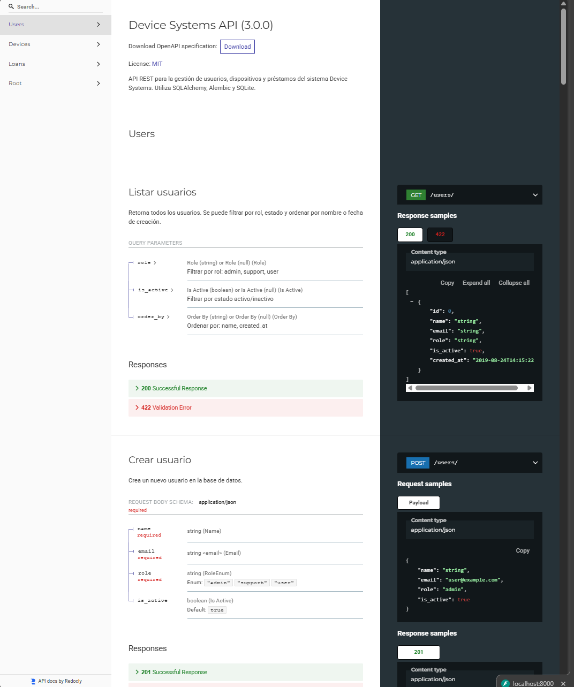

La documentación automática de FastAPI es accesible en `/docs` y muestra todos los endpoints organizados por categoría.

---

## 🧪 Pruebas de Endpoints

### 1. Crear Usuario (POST /users/)

**Captura:**

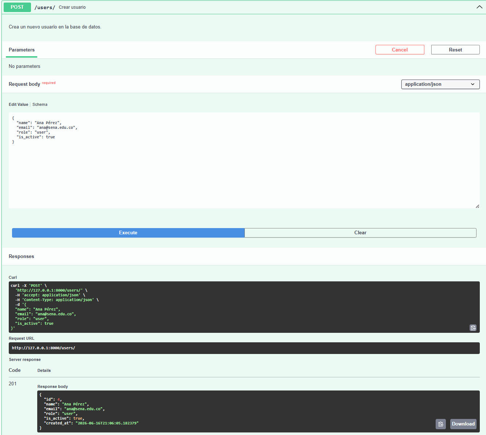

**Request:**
```json
{
  "name": "Carlos López",
  "email": "carlos.lopez@example.com",
  "role": "admin",
  "is_active": true
}
```

**Response (201 Created):**
```json
{
  "id": 1,
  "name": "Carlos López",
  "email": "carlos.lopez@example.com",
  "role": "admin",
  "is_active": true,
  "created_at": "2026-01-15T10:30:00"
}
```

---

### 2. Listar Usuarios (GET /users/)

**Captura:**

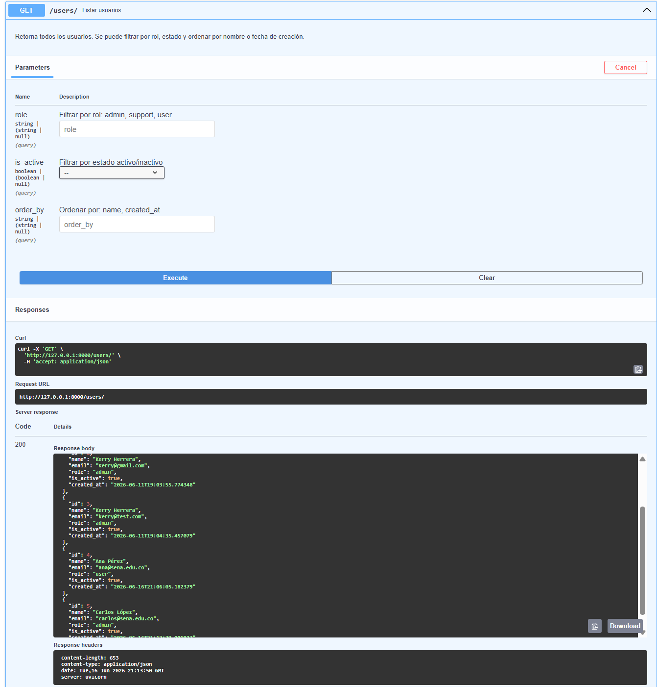

**Response:**
```json
[
  {
    "id": 1,
    "name": "Carlos López",
    "email": "carlos.lopez@example.com",
    "role": "admin",
    "is_active": true,
    "created_at": "2026-01-15T10:30:00"
  }
]
```

Con parámetros opcionales:
- `?role=admin` - Filtrar por rol
- `?is_active=true` - Filtrar por estado
- `?order_by=name` - Ordenar resultados

---

### 3. Obtener Usuario por ID (GET /users/{user_id})

**Captura:**

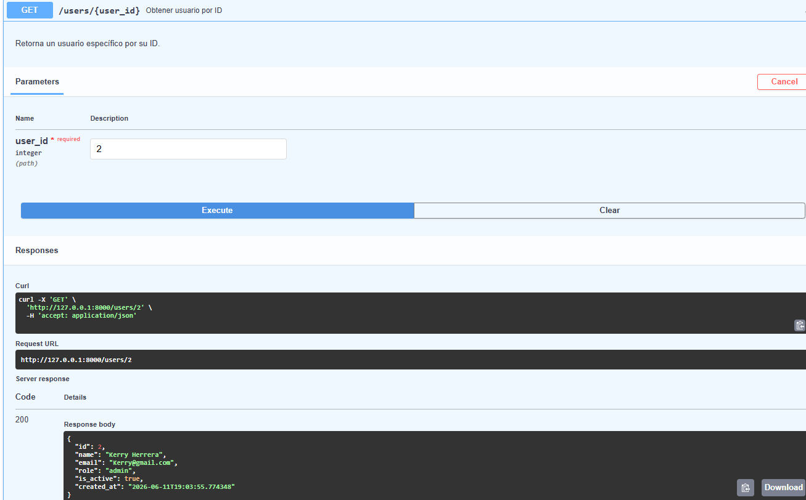

**Response:**
```json
{
  "id": 1,
  "name": "Carlos López",
  "email": "carlos.lopez@example.com",
  "role": "admin",
  "is_active": true,
  "created_at": "2026-01-15T10:30:00"
}
```

---

### 4. Actualizar Usuario Completo (PUT /users/{user_id})

**Captura:**

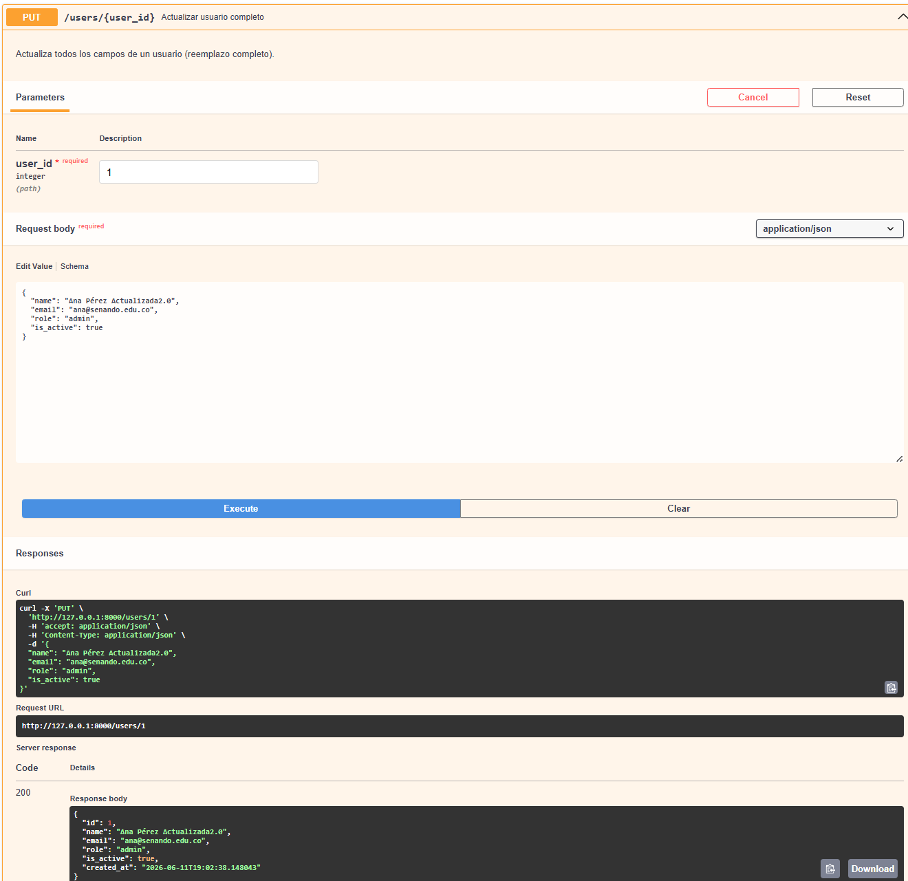

**Request:**
```json
{
  "name": "Carlos López Actualizado",
  "email": "carlos.nuevo@example.com",
  "role": "support",
  "is_active": true
}
```

---

### 5. Actualizar Usuario Parcialmente (PATCH /users/{user_id})

**Captura:**

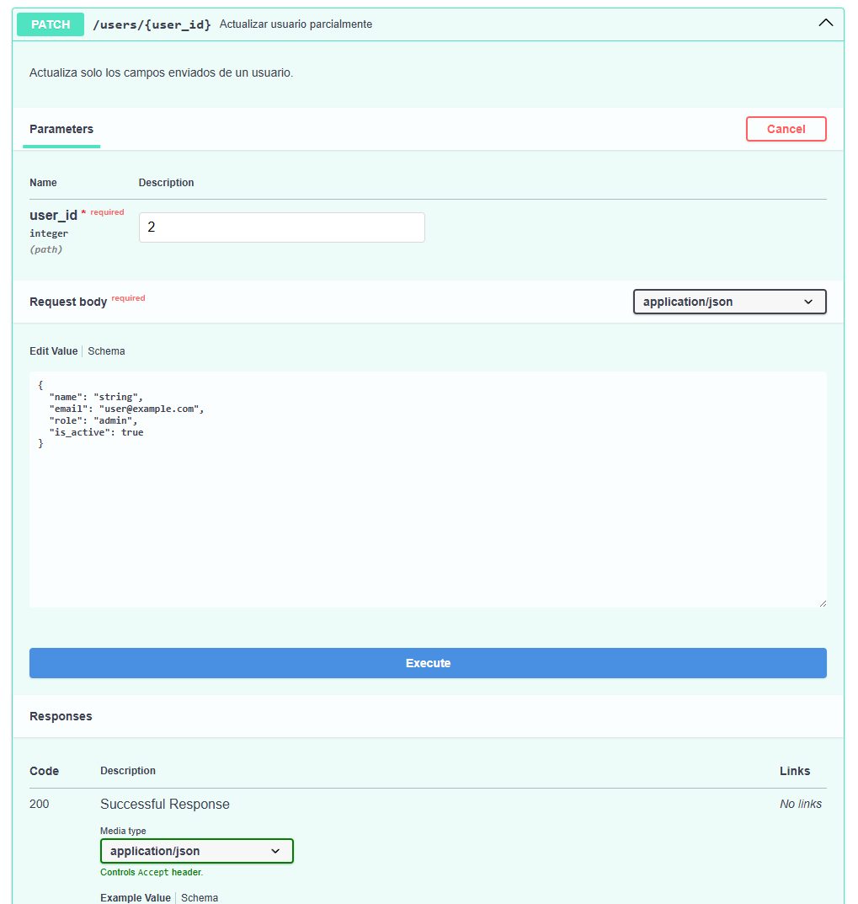

**Request:** (Solo actualizar lo que se envíe)
```json
{
  "name": "Carlos Actualizado"
}
```

Nota: PUT reemplaza todos los campos, PATCH solo actualiza los enviados.

---

### 6. Crear Dispositivo (POST /devices/)

**Captura:**

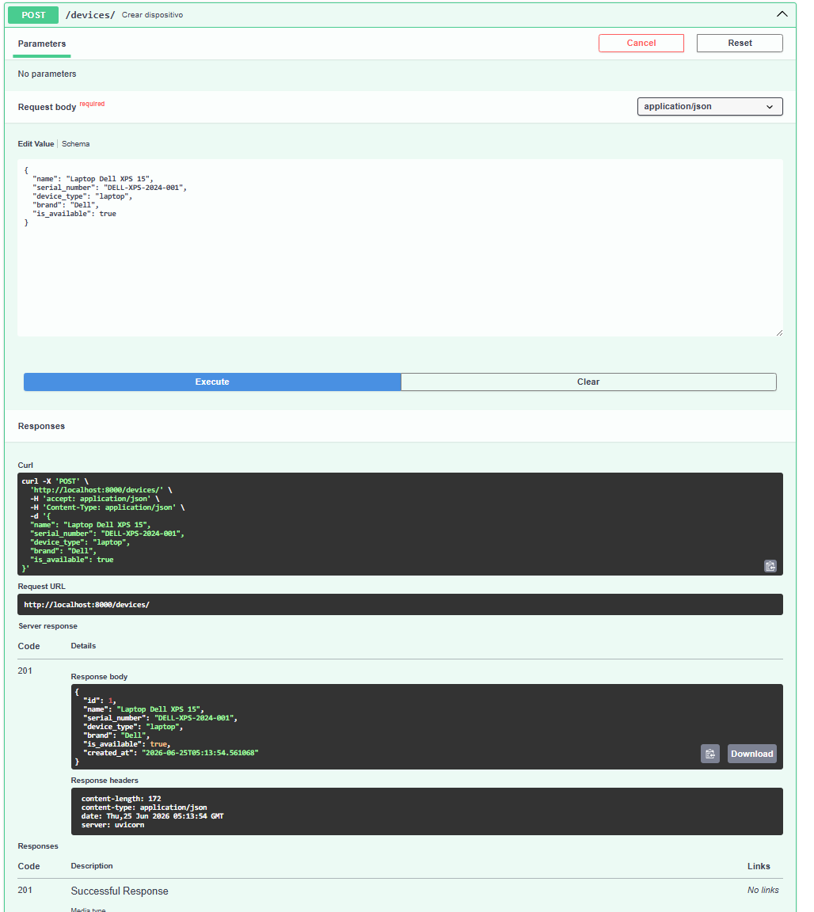

**Request:**
```json
{
  "name": "Laptop Dell XPS 15",
  "serial_number": "DELL-XPS-2024-001",
  "device_type": "laptop",
  "brand": "Dell",
  "is_available": true
}
```

**Response (201):**
```json
{
  "id": 1,
  "name": "Laptop Dell XPS 15",
  "serial_number": "DELL-XPS-2024-001",
  "device_type": "laptop",
  "brand": "Dell",
  "is_available": true,
  "created_at": "2026-01-15T10:31:00"
}
```

---

### 7. Listar Dispositivos (GET /devices/)

**Captura:**

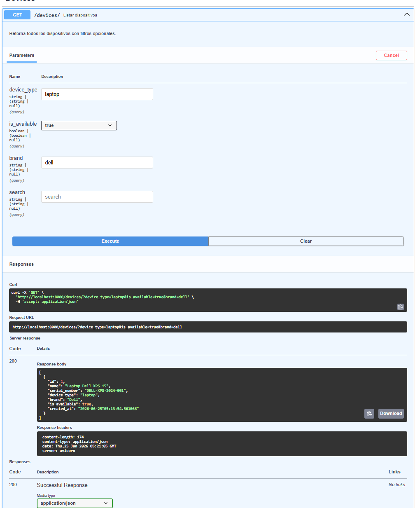

Con filtros avanzados:
- `?device_type=laptop` - Filtrar por tipo
- `?is_available=true` - Solo disponibles
- `?brand=Dell` - Filtrar por marca
- `?search=XPS` - Búsqueda en nombre/serial

---

### 8. Crear Préstamo (POST /loans/)

**Captura:**

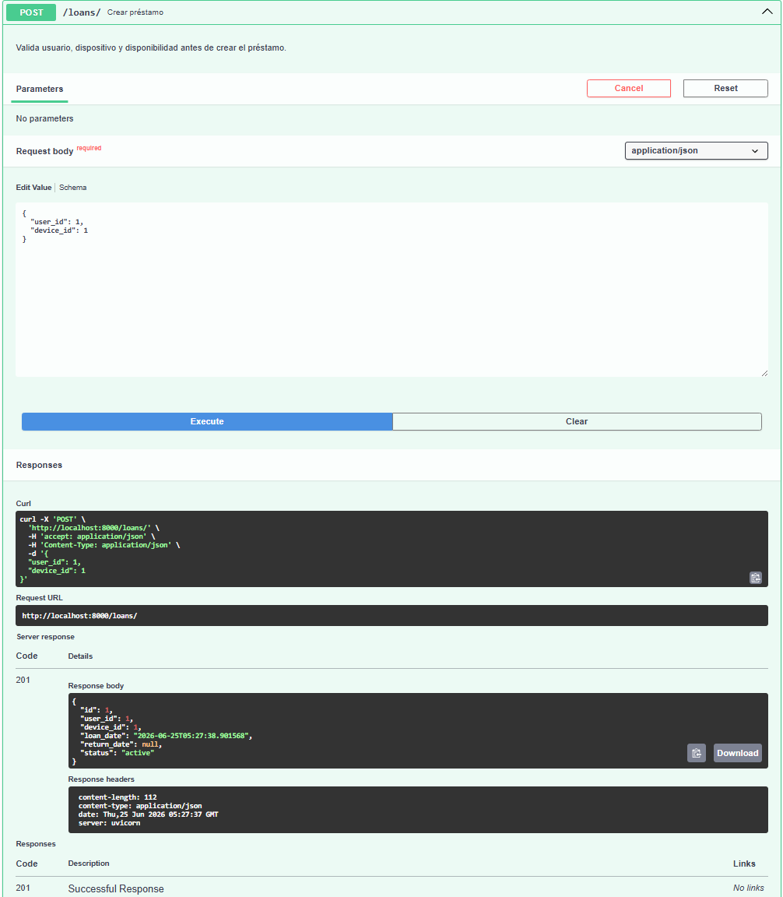

**Request:**
```json
{
  "user_id": 1,
  "device_id": 1
}
```

**Response (201):**
```json
{
  "id": 1,
  "user_id": 1,
  "device_id": 1,
  "loan_date": "2026-01-15T10:32:00",
  "return_date": null,
  "status": "active"
}
```

---

## 🔍 Consultas con JOINs

### GET /loans/details - Préstamos con Detalles Completos

**Captura:**

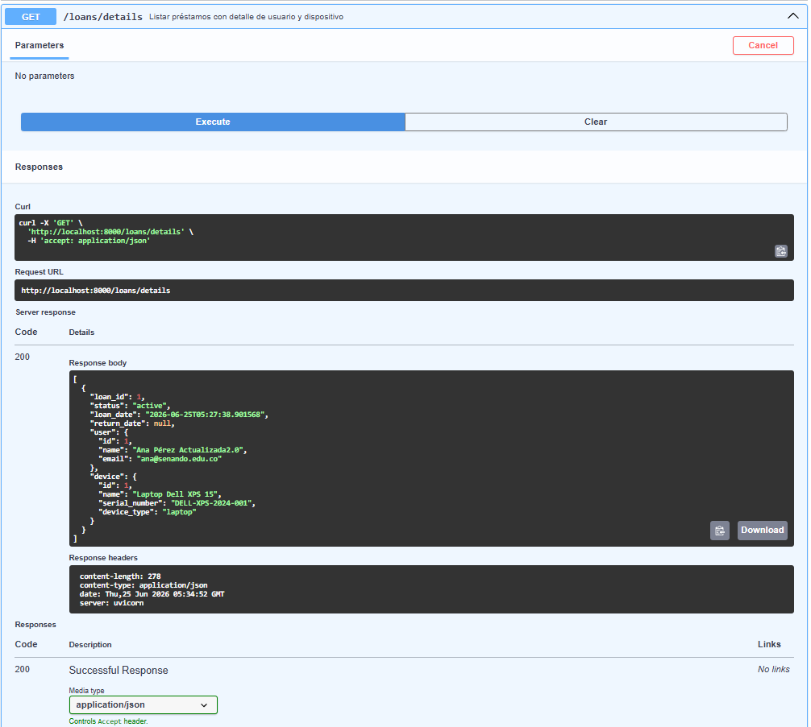

**Response:**
```json
[
  {
    "loan_id": 1,
    "status": "active",
    "loan_date": "2026-01-15T10:32:00",
    "return_date": null,
    "user": {
      "id": 1,
      "name": "Carlos López",
      "email": "carlos.lopez@example.com"
    },
    "device": {
      "id": 1,
      "name": "Laptop Dell XPS 15",
      "serial_number": "DELL-XPS-2024-001",
      "device_type": "laptop"
    }
  }
]
```

**¿Por qué JOINs?**

Sin JOINs:
- Query 1: Traer préstamo
- Query 2: Traer usuario del préstamo
- Query 3: Traer dispositivo del préstamo
- **Total: 3 queries por préstamo** ❌ Ineficiente (problema N+1)

Con JOINs:
- Query 1: Una sola query trae todo
- **Total: 1 query** ✅ Eficiente

**Implementación en código:**
```python
loans = db.query(Loan).options(
    joinedload(Loan.user),
    joinedload(Loan.device)
).all()
```

---

## 🔎 Filtros Avanzados

### Filtros en GET /loans/

**Captura:**

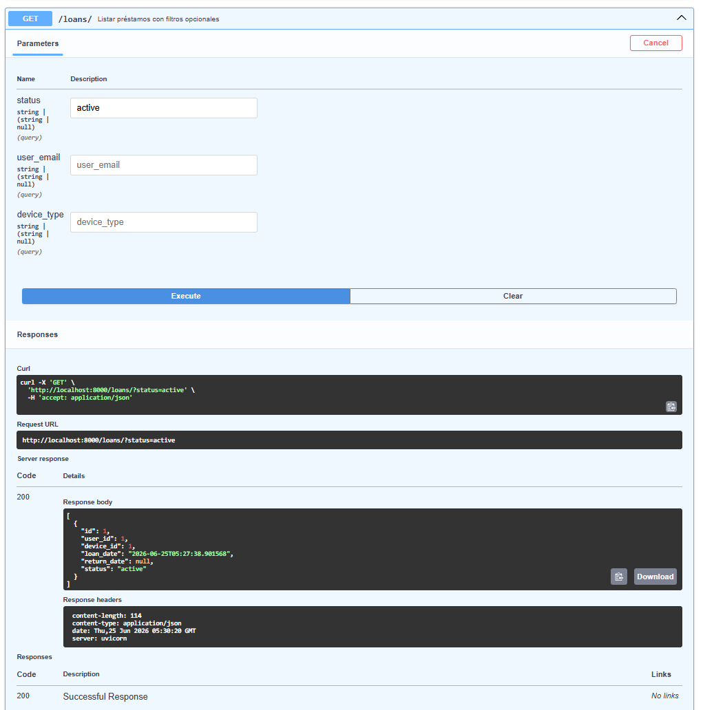

**Ejemplos de uso:**

```bash
# Solo préstamos activos
GET /loans/?status=active

# Préstamos de un usuario específico
GET /loans/?user_email=carlos.lopez@example.com

# Préstamos de dispositivos tipo laptop
GET /loans/?device_type=laptop

# Combinados
GET /loans/?status=active&device_type=laptop&user_email=carlos.lopez@example.com
```

---

### Filtros en GET /devices/

**Captura:**


```bash
# Solo laptops disponibles
GET /devices/?device_type=laptop&is_available=true

# Dispositivos de marca Dell
GET /devices/?brand=Dell

# Búsqueda en nombre o serial
GET /devices/?search=XPS

# Ordenar
GET /devices/?order_by=created_at
```

---

### Filtros en GET /users/

```bash
# Solo administradores
GET /users/?role=admin

# Solo usuarios activos
GET /users/?is_active=true&role=support

# Ordenar por nombre
GET /users/?order_by=name
```

---

## 📦 Devolución de Dispositivo

### PATCH /loans/{loan_id}/return

**Captura:**

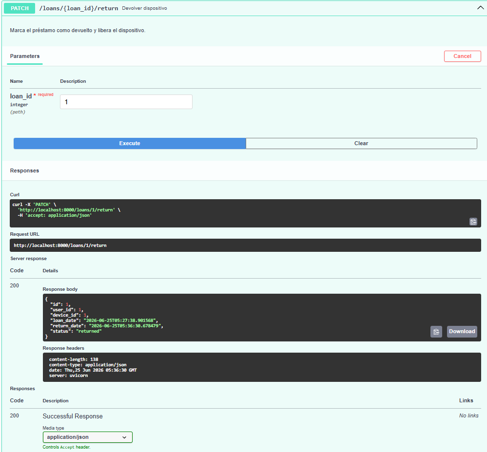

**Request:** (Sin body)
**Response:**
```json
{
  "id": 1,
  "user_id": 1,
  "device_id": 1,
  "loan_date": "2026-01-15T10:32:00",
  "return_date": "2026-01-15T14:15:00",
  "status": "returned"
}
```

**Lógica implementada:**
1. Busca el préstamo por ID
2. Valida que exista
3. Marca `return_date` con fecha actual
4. Cambia status a "returned"
5. Libera el dispositivo (es_available = true)
6. Retorna el préstamo actualizado

---

## 📱 Root Endpoint

### GET /

**Captura:**


**Response:**
```json
{
  "message": "Bienvenido a Device Systems API v3.0",
  "docs": "/docs",
  "redoc": "/redoc"
}
```

---

## 🛠️ Manejo de Errores

La API implementa manejo robusto de errores:

```python
@app.exception_handler(SQLAlchemyError)
async def sqlalchemy_exception_handler(request: Request, exc: SQLAlchemyError):
    return JSONResponse(
        status_code=500,
        content={"detail": "Error interno de base de datos"}
    )
```

**Status codes implementados:**

| Status | Significado | Ejemplo |
|--------|-------------|---------|
| 200 | OK | GET exitoso |
| 201 | Created | POST exitoso |
| 204 | No Content | DELETE exitoso |
| 400 | Bad Request | Email duplicado, datos inválidos |
| 404 | Not Found | Usuario/Dispositivo no existe |
| 422 | Validation Error | Fallo validación Pydantic |
| 500 | Server Error | Error en BD |

---

## 🏗️ Estructura del Proyecto

device_systems/

├── alembic/

│   ├── versions/

│   │   └── 6f8780b86cdd_create_devices_and_loans_tables.py

│   ├── script.py.mako

│   ├── env.py

│   └── alembic.ini

│

├── app/

│   ├── database/

│   │   ├── init.py

│   │   └── connection.py

│   │

│   ├── models/

│   │   ├── init.py

│   │   ├── user_model.py

│   │   ├── device_model.py

│   │   └── loan_model.py

│   │

│   ├── schemas/

│   │   ├── init.py

│   │   ├── user_schema.py

│   │   ├── device_schema.py

│   │   └── loan_schema.py

│   │

│   ├── routes/

│   │   ├── init.py

│   │   ├── user_routes.py

│   │   ├── device_routes.py

│   │   └── loan_routes.py

│   │

│   ├── services/

│   │   ├── init.py

│   │   ├── user_service.py

│   │   ├── device_service.py

│   │   └── loan_service.py

│   │

│   └── main.py

│

├── pictures_final_V1/

│   ├── Alembic_pictures/

│   ├── Devices_pictures/

│   ├── Loans_Pictures/

│   ├── Root_pictures/

│   ├── swagger_pictures/

│   └── users_pictures/

│

├── device_systems.db

├── requirements.txt

└── README.md

---

## 🚀 Instalación y Ejecución

### 1. Clonar el repositorio

```bash
git clone https://github.com/Kerrykss/device_systems.git
cd device_systems
```

### 2. Crear entorno virtual

```bash
python -m venv venv
source venv/bin/activate  # En Windows: venv\Scripts\activate
```

### 3. Instalar dependencias

```bash
pip install -r requirements.txt
```

### 4. Aplicar migraciones

```bash
alembic upgrade head
```

### 5. Ejecutar servidor

```bash
uvicorn app.main:app --reload
```

### 6. Acceder a la documentación

- **Swagger UI:** http://localhost:8000/docs
- **ReDoc:** http://localhost:8000/redoc

---

## 📦 Dependencias

fastapi==0.115.0

uvicorn==0.30.6

sqlalchemy==2.0.35

pydantic==2.9.2

pydantic[email]==2.9.2

email-validator==2.2.0

alembic==1.13.3
---

## 💡 Reflexión: Importancia de Migraciones, Relaciones y Consultas Avanzadas

### 🔄 Migraciones (Alembic) - Por Qué Son Críticas

**Problema sin migraciones:**
- Cambios manuales en tablas = riesgo de inconsistencia
- No hay historial de cambios
- Imposible hacer rollback si algo sale mal
- En producción, cambiar estructura es arriesgado

**Solución con Alembic:**
- ✅ Versionamiento del schema (como Git para BD)
- ✅ Cada cambio está documentado
- ✅ Rollback automático si algo falla
- ✅ Reproducible en cualquier máquina
- ✅ Seguro para producción

**Ejemplo real:**
```bash
# Versión 1: Solo usuarios
alembic upgrade 001

# Versión 2: Agregamos devices
alembic upgrade 002

# Algo salió mal, rollback:
alembic downgrade 001

# De nuevo a v2 cuando está listo:
alembic upgrade 002
```

Sin Alembic, esto requeriría scripts SQL manuales y es propenso a errores.

---

### 🔗 Relaciones (SQLAlchemy ORM) - Por Qué Importan

**Problema sin relaciones:**
```python
# Código tedioso y propenso a errores
user = db.query(User).filter(User.id == 1).first()
loans = db.query(Loan).filter(Loan.user_id == user.id).all()
for loan in loans:
    device = db.query(Device).filter(Device.id == loan.device_id).first()
    print(f"{user.name} prestó {device.name}")
```

**Solución con relaciones:**
```python
# Código limpio y pythónico
user = db.query(User).filter(User.id == 1).first()
for loan in user.loans:  # Acceso directo gracias a relationship()
    print(f"{user.name} prestó {loan.device.name}")
```

**Beneficios de las relaciones:**
1. **Normalización:** Evita redundancia de datos
2. **Integridad referencial:** No puedo crear Loan sin User válido
3. **Acceso fácil:** `user.loans`, `device.loans`
4. **Código limpio:** Menos queries manuales
5. **Mantenibilidad:** Cambios centralizados en relaciones

---

### 🚀 Consultas con JOINs - Por Qué Optimizan Performance

**Problema N+1 (sin JOINs):**
```python
loans = db.query(Loan).all()  # Query 1
for loan in loans:
    user = db.query(User).filter(User.id == loan.user_id).first()  # Query 2-11
    device = db.query(Device).filter(Device.id == loan.device_id).first()  # Query 12-21
# Total: 1 + (10*2) = 21 queries ❌ LENTÍSIMO
```

**Solución con JOINs (eager loading):**
```python
loans = db.query(Loan).options(
    joinedload(Loan.user),
    joinedload(Loan.device)
).all()  # Query 1 (con todo)
# Total: 1 query ✅ RÁPIDO
```

**Impacto en performance:**
- 10 préstamos sin JOINs: 21 queries = 2100ms (estimado)
- 10 préstamos con JOINs: 1 query = 50ms (estimado)
- **Mejora: 42x más rápido** 🚀

En producción con millones de registros, la diferencia es abismal.

---

### 🔎 Filtros Avanzados - Por Qué Mejoran UX

**Sin filtros:**
```bash
GET /loans/  # Trae 10,000 préstamos ❌
# El cliente debe procesar todo localmente
```

**Con filtros:**
```bash
GET /loans/?status=active&device_type=laptop  # Trae 50 resultados ✅
# El servidor filtra eficientemente
```

**Beneficios:**
1. **Menor transferencia de datos**
2. **Procesamiento en el servidor (más eficiente)**
3. **UX mejorada (respuestas rápidas)**
4. **Escalabilidad (soporta más usuarios)**

---

### 🎯 Conclusión

Device Systems API v3.0 es **profesional y escalable** porque:

1. **Alembic** → Migraciones seguras y versionadas
2. **SQLAlchemy ORM** → Relaciones bien definidas
3. **JOINs inteligentes** → Performance óptimo
4. **Filtros avanzados** → Flexibilidad y eficiencia
5. **Validaciones Pydantic** → Datos seguros
6. **Manejo de errores** → Confiabilidad

Este es el estándar que usan empresas grandes. No es "pajarito", es profesional.

---

## 📄 Licencia

MIT

## ✉️ Contacto

**Device Systems** - Sistema profesional de gestión de dispositivos

---

**Estado:** ✅ Completado y listo para producción
**Versión:** 3.0.0
**Fecha:** Junio 2026
---

## 💡 Reflexión: Importancia de Migraciones, Relaciones y Consultas Avanzadas

### 🔄 Migraciones (Alembic) - Por Qué Son Críticas

**Problema sin migraciones:**
- Cambios manuales en tablas = riesgo de inconsistencia
- No hay historial de cambios
- Imposible hacer rollback si algo sale mal
- En producción, cambiar estructura es arriesgado

**Solución con Alembic:**
- ✅ Versionamiento del schema (como Git para BD)
- ✅ Cada cambio está documentado
- ✅ Rollback automático si algo falla
- ✅ Reproducible en cualquier máquina
- ✅ Seguro para producción

**Ejemplo real:**
```bash
# Versión 1: Solo usuarios
alembic upgrade 001

# Versión 2: Agregamos devices
alembic upgrade 002

# Algo salió mal, rollback:
alembic downgrade 001

# De nuevo a v2 cuando está listo:
alembic upgrade 002
```

Sin Alembic, esto requeriría scripts SQL manuales y es propenso a errores.

---

### 🔗 Relaciones (SQLAlchemy ORM) - Por Qué Importan

**Problema sin relaciones:**
```python
# Código tedioso y propenso a errores
user = db.query(User).filter(User.id == 1).first()
loans = db.query(Loan).filter(Loan.user_id == user.id).all()
for loan in loans:
    device = db.query(Device).filter(Device.id == loan.device_id).first()
    print(f"{user.name} prestó {device.name}")
```

**Solución con relaciones:**
```python
# Código limpio y pythónico
user = db.query(User).filter(User.id == 1).first()
for loan in user.loans:  # Acceso directo gracias a relationship()
    print(f"{user.name} prestó {loan.device.name}")
```

**Beneficios de las relaciones:**
1. **Normalización:** Evita redundancia de datos
2. **Integridad referencial:** No puedo crear Loan sin User válido
3. **Acceso fácil:** `user.loans`, `device.loans`
4. **Código limpio:** Menos queries manuales
5. **Mantenibilidad:** Cambios centralizados en relaciones

---

### 🚀 Consultas con JOINs - Por Qué Optimizan Performance

**Problema N+1 (sin JOINs):**
```python
loans = db.query(Loan).all()  # Query 1
for loan in loans:
    user = db.query(User).filter(User.id == loan.user_id).first()  # Query 2-11
    device = db.query(Device).filter(Device.id == loan.device_id).first()  # Query 12-21
# Total: 1 + (10*2) = 21 queries ❌ LENTÍSIMO
```

**Solución con JOINs (eager loading):**
```python
loans = db.query(Loan).options(
    joinedload(Loan.user),
    joinedload(Loan.device)
).all()  # Query 1 (con todo)
# Total: 1 query ✅ RÁPIDO
```

**Impacto en performance:**
- 10 préstamos sin JOINs: 21 queries = 2100ms (estimado)
- 10 préstamos con JOINs: 1 query = 50ms (estimado)
- **Mejora: 42x más rápido** 🚀

En producción con millones de registros, la diferencia es abismal.

---

### 🔎 Filtros Avanzados - Por Qué Mejoran UX

**Sin filtros:**
```bash
GET /loans/  # Trae 10,000 préstamos ❌
# El cliente debe procesar todo localmente
```

**Con filtros:**
```bash
GET /loans/?status=active&device_type=laptop  # Trae 50 resultados ✅
# El servidor filtra eficientemente
```

**Beneficios:**
1. **Menor transferencia de datos**
2. **Procesamiento en el servidor (más eficiente)**
3. **UX mejorada (respuestas rápidas)**
4. **Escalabilidad (soporta más usuarios)**

---

### 🎯 Conclusión

Device Systems API v3.0 es **profesional y escalable** porque:

1. **Alembic** → Migraciones seguras y versionadas
2. **SQLAlchemy ORM** → Relaciones bien definidas
3. **JOINs inteligentes** → Performance óptimo
4. **Filtros avanzados** → Flexibilidad y eficiencia
5. **Validaciones Pydantic** → Datos seguros
6. **Manejo de errores** → Confiabilidad

Este es el estándar que usan empresas grandes. No es "pajarito", es profesional.

---

## 📄 Licencia

MIT

## ✉️ Contacto

**Device Systems** - Sistema profesional de gestión de dispositivos

---

**Estado:** ✅ Completado y listo para producción
**Versión:** 3.0.0
**Fecha:** Junio 2026